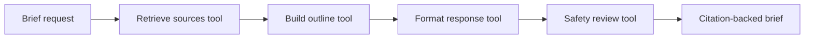

# SourceWise Dawah Agent

SourceWise Dawah Agent is a source-grounded planning assistant for masjid and MSA content. It retrieves from a small curated knowledge base, runs a multi-step tool workflow, and returns citation-backed outlines, captions, or study-circle plans with a review checklist.

The project is intentionally safe-by-default: it does not issue fatwas, it cites the local notes it used, and it includes human review steps before anything is published.

## Demo

Screenshot placeholders:

- `docs/screenshots/api-response.png` - FastAPI response with citations.
- `docs/screenshots/cli-demo.png` - CLI output for a Jumuah reminder.
- `docs/screenshots/architecture.png` - tool workflow diagram.

Run a local example:

```bash
python -m venv .venv
source .venv/bin/activate
pip install -e ".[dev]"
python -m app.cli --topic "welcoming new Muslim students" --audience "college MSA" --content-type study_circle_plan
```

Start the API:

```bash
uvicorn app.main:app --reload
```

Then open `http://127.0.0.1:8000/docs`.

## Architecture



## Agent Tools

- `retrieve_sources`: scores local Markdown source chunks against the request.
- `build_outline`: turns the strongest chunks into a structured plan.
- `format_response`: shapes the plan for a khutbah outline, social caption, or study circle.
- `safety_review`: adds review checks for citations, tone, scope, and community fit.

The default implementation is deterministic so tests and demos run anywhere. The `.env.example` leaves room for an optional `OPENAI_API_KEY` if you want to extend the formatting tool with a hosted model later.

## API

```http
POST /api/briefs
Content-Type: application/json

{
  "topic": "welcoming new Muslim students",
  "audience": "college MSA",
  "content_type": "study_circle_plan",
  "tone": "warm and practical"
}
```

Useful routes:

- `GET /health`
- `GET /api/sources`
- `POST /api/briefs`

## Local Setup

```bash
cp .env.example .env
python -m venv .venv
source .venv/bin/activate
pip install -e ".[dev]"
pytest
uvicorn app.main:app --reload
```

## Docker

```bash
docker build -t sourcewise-dawah-agent .
docker run --rm -p 8000:8000 sourcewise-dawah-agent
```

## Deployment

Deploy the Docker image to Render, Fly.io, Railway, or any container host.

Environment variables:

- `SOURCEWISE_DATA_DIR`: optional path to Markdown sources.
- `OPENAI_API_KEY`: optional future extension; not required for the included agent.

## CI Template

The GitHub Actions workflow template is included at `docs/github-actions/ci.yml`. Move it to `.github/workflows/ci.yml` after authenticating GitHub CLI with the `workflow` scope.

## Roadmap

- Admin UI for uploading reviewed source notes.
- Vector database option with pgvector or Chroma.
- OpenAI tool-calling formatter behind the deterministic planner.
- Feedback log for reviewers to mark weak citations or tone issues.

## Recruiter Notes

This repo demonstrates RAG architecture, tool orchestration, FastAPI, CLI design, Docker, tests, CI, and careful product thinking around a real community workflow.
